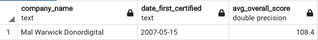

# B Corporations
Analyzing B_corps business data from B-labs

## Scope of Analysis
The purpose of this analysis is a personal project created so I can explore, learn about and access B Corporation data.

The aim is to explore similarities and differences between industries and business size as well as longitudinal data to confirm increase in B Corp certifications year over year.

The three questions I wish to address are:
1. What business size are most likely to become B Corps Certified?
2. What trends can be seen by industries/categories becoming certified over the years?
3. Where are BCorps predominantly located?

## Tools Used
- Python
- Jupyter Notebook
- PostgreSQL and PGAdmin
- Sci-Kit Learn - Unsupervised Learning 
- Tableau

## What is a B Corp?

<i> "Certified B Corporations are businesses that meet the highest standards of verified social and environmental performance, public transparency, and legal accountability to balance profit and purpose. B Corps are accelerating a global culture shift to redefine success in business and build a more inclusive and sustainable economy.

Society’s most challenging problems cannot be solved by government and nonprofits alone. The B Corp community works toward reduced inequality, lower levels of poverty, a healthier environment, stronger communities, and the creation of more high quality jobs with dignity and purpose. By harnessing the power of business, B Corps use profits and growth as a means to a greater end: positive impact for their employees, communities, and the environment.

B Corps form a community of leaders and drive a global movement of people using business as a force for good. The values and aspirations of the B Corp community are embedded in the B Corp Declaration of Interdependence." 
</i>

To read more about the BCorp Mission and qualifications, please visit their <a href="https://bcorporation.net/about-b-corps">website</a>.

An article from Harvard Business Review on why businesses may chose to become B Corporations is linked  
<a href="https://hbr.org/2016/06/why-companies-are-becoming-b-corporations">here</a>.

## Measures of Success
B Corporations must have an overall score of 80 to be listed as a B Corp. The highest score is 200.

From <a href="https://data.world/blab/b-corp-impact-data">data.world</a>:

### Overall Score
A company's overall score is based on their answers to roughly 200 questions. A company begins with zero points and earns points incrementally for each indicator of positive outcome/best practice.

### Impact Area - Community
The Community Impact Area evaluates the company's positive impact on the external communities in which the company operates, covering topics like diversity, economic impact, civic engagement, and supply chain impact.

### Impact Area - Customers
The Customers Impact Area evaluates the company's value to their direct customers and the consumers of their products or services.

### Impact Area - Environment
The Environment Impact Area evaluates the company's overall environmental stewardship, including how the company identifies and manages general environmental impacts, air &climate issues, water sustainability, and impacts on land and life

### Impact Area - Governance
The Governance Impact Area evaluates a company's overall mission, ethics, accountability and transparency

### Impact Area - Workers
The Workers Impact Area evaluates the company's contribution to its employees financial, physical, professional, and social well-being

## Analysis

To clean my data, I used a jupyter notebook, pandas and python language. I inspected each column for data quality and evaluated which columns could potentially be problematic for drawing conclusions.

I then established a pipeline through PgAdmin using PostgreSQL to continue querying the data and setting up a database for the ML notebook to pull from.

I performed a KMeans analysis on the data, dividing it into 2 clusters

In a separate notebook I have analyzed the components of each business size. 

I also performed SQL queries to visualize the data.

## Results

To answer the following questions, I have spent some time going through the data

The dataset is composed of certified and decertified businesses.

</img>

B Labs began certifying businesses in 2007. 
The first business certified was Mal Warwick Donordigital.

</img>

The most businesses were assessed in 2017.

</img>

The most new certifications took place in 2016.
</img>

1. What business size are most likely to become B Corps Certified?

    - The bulk of the businesses are either small (1-9 employees), medium (10-49 employees) or unknown size. 

</img>

2. What industries/categories becoming certified over the years?

    - Business Products and Services and Customer Products and Services make up the most of of the industry categories

 </img>

3. Where are BCorps predominantly located?

    - Of the currently certified businesses, these are the top ten countries for B Corps locations.

</img>

## Visualization and Presentation
<a href="https://docs.google.com/presentation/d/1t-suGFPWUANrffg5ZB7ymyHaEpuBMtLCo4PpjYxcfpI/edit#slide=id.gc6f73a04f_0_0"> Google Slides </a>

<a href="https://public.tableau.com/profile/stephanie.m.juniper#!/vizhome/B_Corp_Study/ClusterDashboard">Interactive Map of BCorp/Cluster</a>

<a href="https://public.tableau.com/app/profile/stephanie.m.juniper/viz/B_Corp_Study/ImpactAreasbyIndustryCountrybyTime">Impact Scores By Industry and Country</a>

<a href="https://public.tableau.com/app/profile/stephanie.m.juniper/viz/BCorpTrends/SizeTrends">Trends by Business Size</a>

## Data Source and Inspiration
B Labs provide a data set through data.world
<a href="https://data.world/blab/b-corp-impact-data">here</a>.

## Limitations of the Analysis
- Small dataset
- Self Assessed and Inputted, Room for errors and discrepancies

## Contact information
Stephanie Juniper

stephanie.m.juniper@gmail.com

